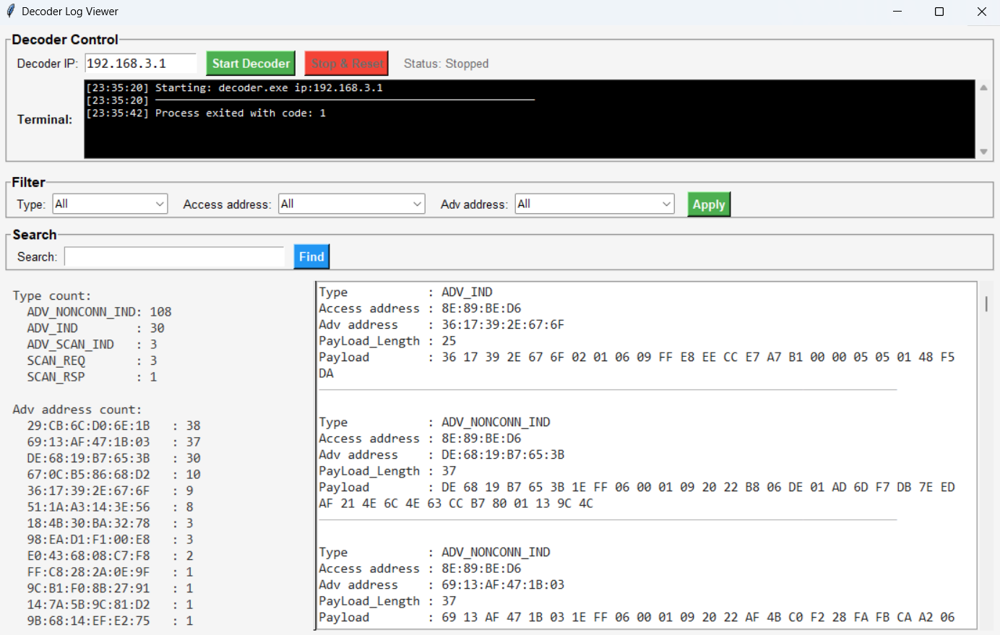

# Link Layer Detector

This repository contains the design for a fully customizable Bluetooth Low Energy (BLE) PHY-layer demonstration platform built using Analog Devices ADALM-Pluto SDRs. The platform provides fine-grained control over BLE packet construction, modulation, and transmission timing, enabling in-depth exploration of BLE link-layer behavior.

## Repository Structure
```
src/
├── link_layer_detector/
│ ├── tx_python/
│ │ └── Modules/ # Python BLE transmitter modules 
│ ├── rx_c/ # C implementation of BLE decoder
│ ├── transmitter.py # GUI for BLE transmitter 
│ └── decoder.py # GUI for BLE Decoder
```

## Features

- Full control over PHY-layer parameters and GAP payloads

- Precise tuning of inter-packet intervals

- Custom definition of packet sequences (ADV_IND, SCAN_REQ, SCAN_RSP, etc.)

You can monitor Real-time BLE packet traffic via:

- Custom SDR-based BLE decoder under decoder.py GUI

- Texas Instruments CC2540 Packet Sniffer (If you have this in hand)


## overview of GUIs


<div align="center"><b>Decoder GUI</b></div>


<div align="center"><b>Transmitter GUI</b></div>


<div align="center"><b>Sniffer Capture</b></div>


## Current stage

The core interface with SDR code in `src/link_layer_detector/rx_c` and `src/link_layer_detector/tx_python`, which includes all control targets for the GUI, is part of a larger project currently under review at another conference. The code will **surely** be made open source once we receive feedback.